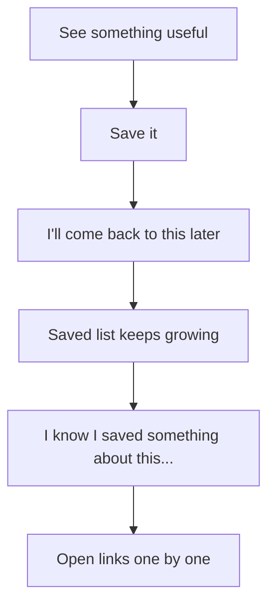
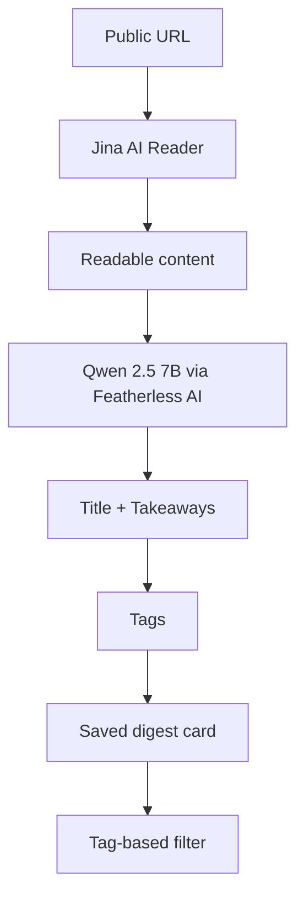
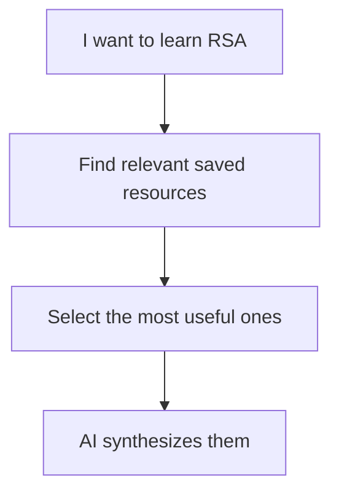
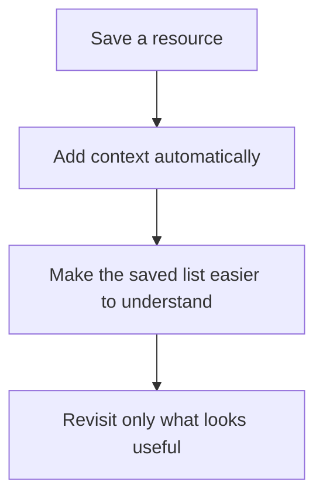
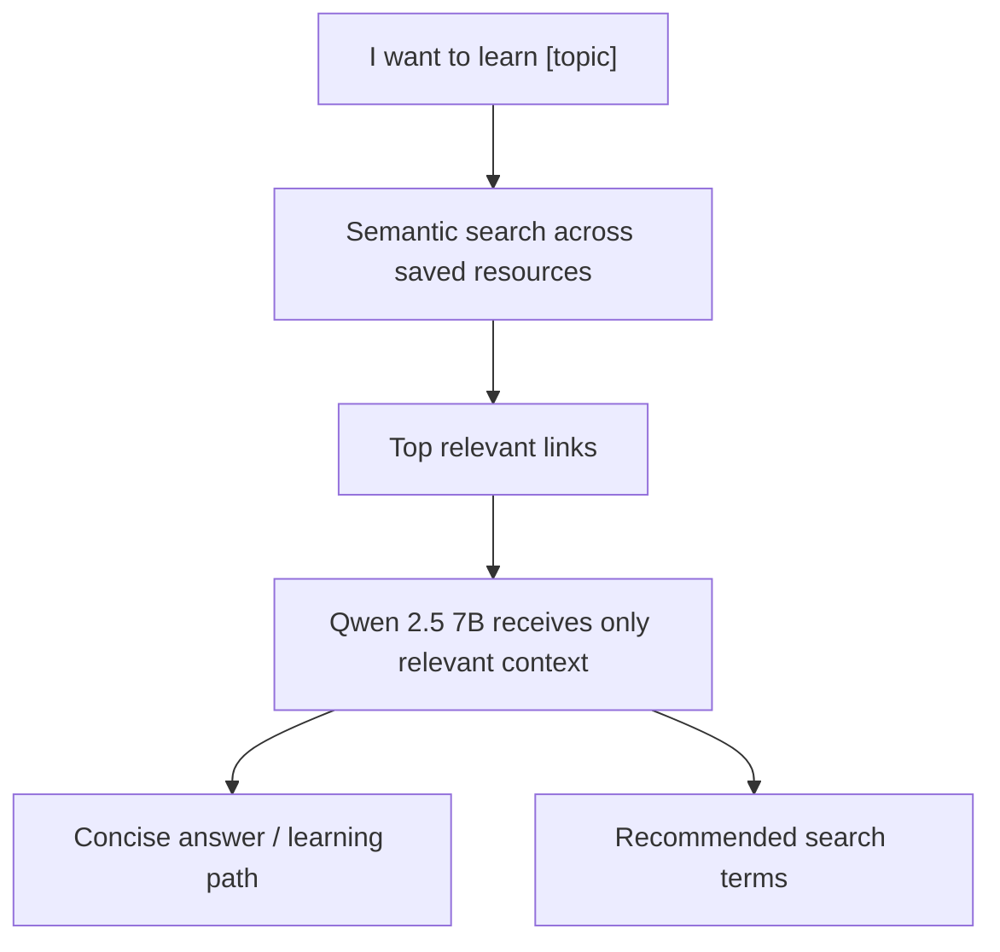
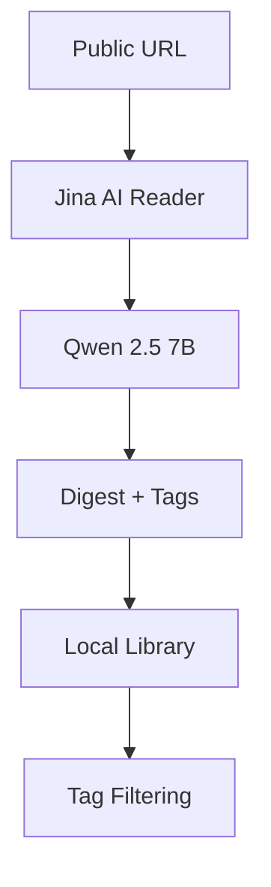

# Digestify ⚡

> **Turn the links you keep saving into bite-sized AI digests you can actually use later.**

[](https://digestify-bice.vercel.app/)


<p align="center">
  <b>Preview</b><br>
  <sub><i>(Automatically adapts to your GitHub appearance settings. Toggle your GitHub theme to view light/dark mode!)</i></sub>
</p>

<p align="center">
  <picture>
    <source media="(prefers-color-scheme: dark)" srcset="assets/demo-dark.gif">
    <source media="(prefers-color-scheme: light)" srcset="assets/demo-light.gif">
    
  </picture>
</p>

> **Hackathon MVP:** Save a public URL → generate an AI digest → tag it → scan your saved library.

---

## The Problem

Saving useful content has become almost effortless.

As developers and students, we save technical docs, useful articles, tutorials, videos, papers, posts, and other resources with the intention of coming back to them later. The same habit happens constantly on YouTube, TikTok, Instagram, and across the web: see something useful, save it, move on.

The problem comes later.

You remember **that you saved something about a topic**, but not which link it was, what it contained, or why you saved it in the first place. As the list grows, opening saved items one by one just to figure out what they are becomes tedious.



**Digestify adds context to the saved items themselves.**

Instead of storing another pile of URLs, it turns each saved link into a short digest with key takeaways and topic tags, making the collection easier to scan and revisit.

---

## What Digestify Does

Digestify takes a public web URL and turns it into a compact summary card.



Each digest contains:

- A generated title
- Three requested key takeaways
- Automatically generated topic tags
- The original source URL
- A timestamp

The summary is meant to provide enough context to decide whether the original resource is worth reopening.

---

## Current MVP Features

### 🔗 URL → AI Digest

Paste a public HTTP/HTTPS URL and Digestify retrieves readable page content before sending it to Qwen 2.5 7B for summarization.

The model is instructed to return a structured result containing:

```json
{
  "title": "...",
  "summary": ["...", "...", "..."],
  "tags": ["...", "..."]
}
```

### 🏷️ Automatic Tags

Each digest receives generated topic tags such as:

```text
#AI   #WebDev   #Cybersecurity
```

The dashboard aggregates these tags into filter controls so you can narrow down the saved collection.

### 📚 Saved Digest Library

Generated digests are stored in the browser and displayed as cards containing the summary, tags, timestamp, and source link.

You can:

- Filter by tag
- Open the original resource
- Copy a digest
- Delete a saved item

### ✨ Small UX Feedback

Common actions provide immediate visual feedback. For example, the copy button switches to a check icon for two seconds after a successful copy.

Loading and error states are also surfaced in the UI instead of leaving the user guessing whether a request is still running or failed.

---

## Technical Implementation

### Web Content Retrieval

Digestify currently uses **Jina AI Reader** to turn public URLs into readable page content.

The server first attempts an authenticated Jina request when `JINA_API_KEY` is available. If that request fails, it retries without authentication.

This keeps the content-extraction layer separate from the summarization model and avoids implementing a full browser-based scraping pipeline for the MVP.

### AI Summarization

The extracted content is sent to:

```text
Qwen/Qwen2.5-7B-Instruct
```

through the Featherless AI API.

The summarization prompt requests a compact structured response with a title, three takeaways, and two to four tags.

### Prompt Size Protection

Retrieved content is capped at 8,000 characters before being sent to the model:

```ts
content.slice(0, 8000)
```

This keeps model input bounded and avoids unnecessarily large requests.

### Structured Response Handling

LLM output is not assumed to be perfectly formatted.

Digestify extracts the JSON object from the response, parses it, filters the returned summary and tag values, and provides fallback values when parts of the response are malformed.

### Browser Storage

The current MVP stores digests in:

```text
localStorage["digestify_notes"]
```

Browser storage keeps the prototype simple and requires no database or account system.

This is an **MVP implementation choice, not a core product differentiator**. It also means the current library is local to the browser and is not synchronized across devices.

---

## Current Limitations

The MVP deliberately keeps the scope small.

### No full-text or semantic search yet

The current dashboard supports **tag-based filtering**, but not natural-language or full-text search.

For example, this is a future capability:



That workflow is not part of the current MVP.

### Source compatibility depends on extracted content

Digestify accepts public web URLs, but it does not implement custom parsers for every platform.

It cannot bypass anti-bot protections like Cloudflare turnstiles, Captchas, or paywalls common on advanced research repositories and premium publishers.

Whether a particular page can be summarized depends on whether Jina AI Reader can retrieve usable readable content from it.

### Local-only storage

There are no accounts, cross-device synchronization, or server-side persistence yet.

---

## Why This Direction?

Digestify is not trying to become another place to collect links.

The current MVP focuses on one missing step between **saving** and **revisiting**:



The long-term goal is to make that context useful for **retrieval by intent**, rather than requiring the user to remember the title or tag of something they saved.

---

## Roadmap

### Phase 1: Better Library Management

The next iteration focuses on making the saved library more persistent and practical.

- **Supabase / PostgreSQL storage** for persistent server-side data
- Cross-device access and eventually user accounts
- Batch URL processing
- Parallel summarization
- Inline editing of titles, summaries, and tags
- Better loading and failure feedback
- Rate limiting and model-usage controls
- Stronger API-key and production security

### Phase 2: Context-Aware Curated Summaries

The larger vision is to evolve Digestify from a collection of summary cards into an assistant that can work with the resources a user has already saved.

A possible workflow:



This would use embeddings to represent saved content and a vector-search layer to retrieve relevant resources before generation.

The same foundation could support:

- **Daily curated summary** from recently saved resources
- **Prompt-based resource discovery**
- **AI summaries across multiple saved links (Synthesis)**
- **Personalized learning paths**
- **Recommendations for topics missing from the saved collection (Knowledge Gap)**

The exact storage and vector-search architecture is still subject to implementation.

---

## Tech Stack

| Layer | Technology |
|---|---|
| Framework | Next.js 16, React 19 |
| Language | TypeScript |
| Styling | Tailwind CSS |
| AI Inference | Featherless AI |
| Model | Qwen/Qwen2.5-7B-Instruct |
| Web Content Extraction | Jina AI Reader |
| Icons | Lucide React |
| Current Storage | Browser `localStorage` |
| Deployment Target | Vercel |
| License | MIT |

---

## Local Development

### 1. Clone the repository

```bash
git clone https://github.com/PixelDavon/digestify.git
cd digestify
npm install
```

### 2. Configure environment variables

Create `.env.local` in the project root:

```env
FEATHERLESS_API_KEY=your_featherless_api_key_here
JINA_API_KEY=your_jina_api_key_here
```

`FEATHERLESS_API_KEY` is required for summarization.

`JINA_API_KEY` is used for the preferred authenticated Jina request; the current implementation also retries Jina without authentication when that request fails.

### 3. Start the development server

```bash
npm run dev
```

Open [http://localhost:3000](http://localhost:3000).

---

## Project Status

Digestify is currently a **hackathon MVP**.

The implemented workflow is:



Semantic search, persistent cloud storage, AI recommendations, daily briefings, and multi-resource synthesis are part of the planned next iteration rather than the current implementation.

---

## License

This project is licensed under the MIT License.